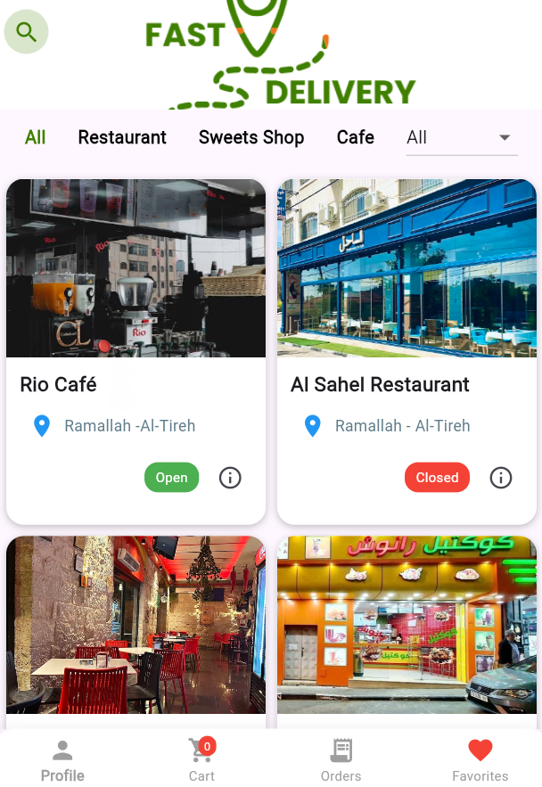

#  Online Delivery Application

   

------------------------------------------------------------------------

## 📖 Overview

This is a mobile app built with *Flutter* that allows users to order food and other items from different shops. Users can choose delivery locations, pay online or on delivery, and track their orders. Admins can manage their shops and view orders easily.

------------------------------------------------------------------------

## ✨ Features

### Customer Features

* Browse shops and products
* Add items to cart and place orders
* Add items to favorites for easy access later
* Search for products by name or view shops by type (restaurant  | sweets shop | cafe) or location 
* View order history and order details

### Admin Features

* View shops linked to the admin
* Manage Shop and proudect (add, delete, update)
* Select a shop to see today's and previous orders
* Tap an order to see detailed info (customer info, items, quantity, price, notes)
* Beautiful bottom sheet UI for order details with images

### Other Features

* Signup with personal info: username, gender, date of birth, location, phone, role
* Login with email and password
* Remember Me option for faster login
* Splash screen with fade & slide animation
* Onboarding screen for first-time users
* View and update profile Info
* Form validations for email, password, phone, and other fields

------------------------------------------------------------------------

## 🖥 Screens

1. *Splash Screen* – Animated app logo.  
   

2. *Onboarding Screen* – Intro to app features.  
   

3. *Login Screen* – Login with Remember Me.  
   

4. *Signup Steps 1 & 2* – User registration with validations.  
   

5. *Home Screen*  

   5.1 Customer Home  
   

   5.2 Admin Home  
   

6. *Product Detail Screen* – Shows product name, description, image.  

   6.1 Menu Screen (Customer)  
   

   6.2 Shop and Product Screen (Admin)  
   

7. *Cart Screen* – Shows selected products, total price, checkout.    
   

8. *Favorite Screen* – Shows favorite products.  
   

9. *View Orders Screen*  

   9.1 View Order (Admin)  
   

   9.2 View Order (Customer)  
   

10. *Profile Screen* – View and edit profile information.  
    

------------------------------------------------------------------------

## 🛠 Technologies Used

* *Flutter & Dart* – Frontend
* *SharedPreferences* – Store login info
* *HTTP & JSON* – Backend communication
* *PHP & MySQL* – Backend API

------------------------------------------------------------------------

## 🚀 How to Run

1. Clone this repository:

bash
git clone https://github.com/miraalabed/Online-Delivery-App.git

2. Install dependencies:

bash
flutter pub get

3. Start your local PHP server with MySQL database.
4. Run the app:

bash
flutter run

> Make sure backend URLs (http://localhost/project/...) match your server setup.

------------------------------------------------------------------------

## 📌 Notes

* Admin and Customer roles have different screens and functionalities.
* Missing images use placeholders automatically.
* Animations improve UX (splash screen, order details bottom sheet).

------------------------------------------------------------------------

## 👤 Contact

For inquiries or contributions, feel free to reach out: 
- *Email*: miraalabed21@gmail.com
- *GitHub*: [Mira Al-Abed](https://github.com/miraalabed)

------------------------------------------------------------------------

© 2025 Online Delivery App. All rights reserved.
